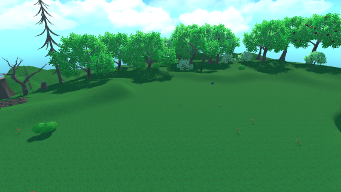
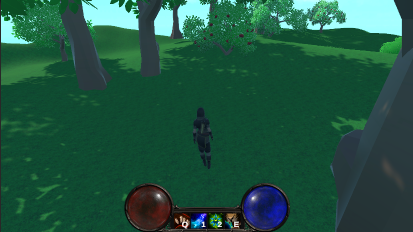
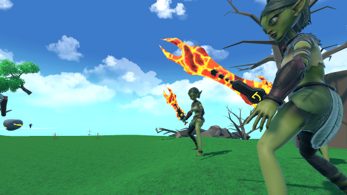
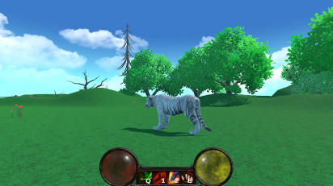

# Druid's Tale

Druid's Tale is a 3D RPG platformer game where you embark on an exciting adventure as a powerful druid with the ability to shape-shift into a tiger and a bear. Each animal form offers unique abilities, strengths, and weaknesses, providing a diverse and engaging gameplay experience. Explore a beautifully decorated floating forest while facing challenging enemies. Overcome a variety of platform types, including moving platforms, falling platforms, and more, adding an extra layer of challenge to your journey.

## Key Features

- Shape-shift into a tiger and a bear, each with distinct abilities:
  - Tiger: Agile and fast, perfect for traversing tricky platforms and executing swift attacks.
  - Bear: Strong and sturdy, capable of dealing heavy damage and withstanding powerful blows.
- Engaging RPG elements, allowing you to level up your druid and unlock new abilities as you progress through the game.
- Beautifully crafted floating forest environment, filled with lush vegetation, mysterious ruins, and breathtaking vistas.
- Challenging enemies and boss battles that require you to master your animal forms and exploit their unique strengths.
- Exciting platforming challenges, including intricate jumps, precise timing, and environmental puzzles.
- Hidden secrets and collectibles to discover, rewarding exploration and curiosity.

## Controls
- Movement: W, A, S, D
- Jump: Spacebar
- Shape-shift: Q and E
- Special Abilies: 1 and 2

## Form Abilities

|Form    | Name          | Description                   | Amount | Resource Cost | Cooldown |
|--------|---------------|-------------------------------|--------|---------------|----------|
|Human   | Wrath         | Damaging AoE                  | 30     | 70            | 7s       |
|Human   | Regeneration  | Healing over time             | 50     | 50            | 9s       |
|Tiger   | Shred         | Bleed Single Target           | 15     | 20            | 2s       |
|Tiger   | Ferocious Bite| Damaging Single Target        | 30     | 30            | 4s       |
|Bear    | Swipe         | Damaging Single Target        | 15     | 20            | 2s       |
|Bear    | Growl         | Crowd Control                 | 5      | 100           | 10s      |    

## Assets Used
- [Icons](https://assetstore.unity.com/packages/2d/gui/icons/free-rpg-fantasy-spell-icons-200511)
- [Magic Effects](https://assetstore.unity.com/packages/vfx/particles/spells/magic-effects-free-247933)
- [Sword](https://assetstore.unity.com/packages/3d/props/weapons/free-low-poly-swords-rpg-weapons-198166)
- [Environment](https://assetstore.unity.com/packages/3d/environments/lowpoly-environment-nature-free-medieval-fantasy-series-187052)